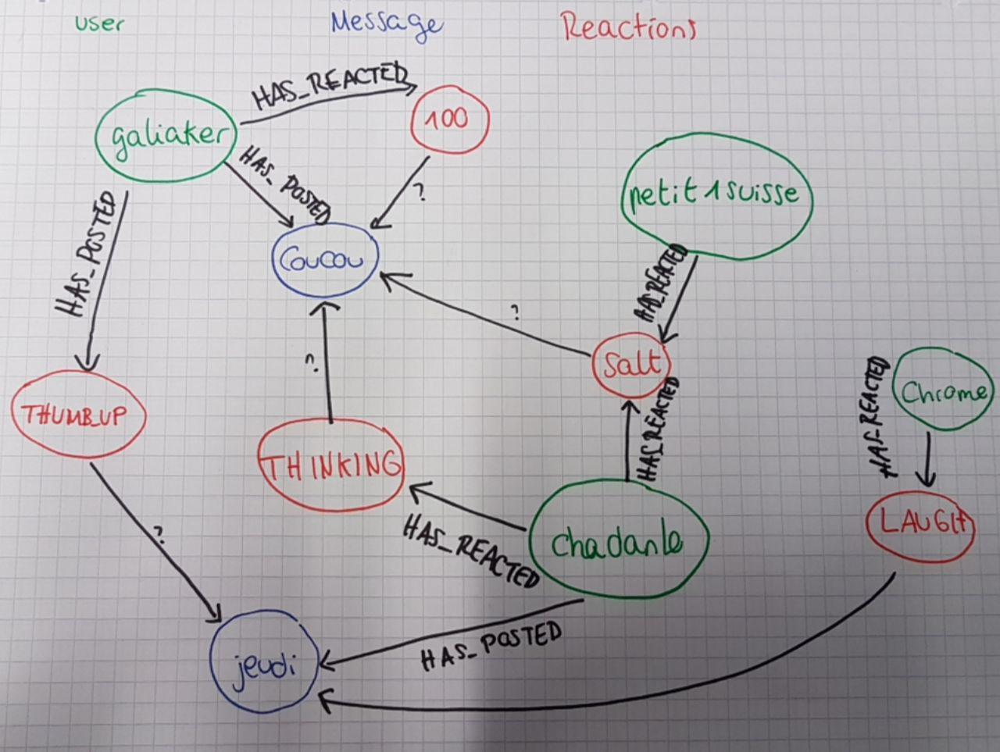

# MAC Modèle de données

## Modèle graphe



## Modèle document

```json
User {
	id // discord id
  nickname // first nickname registered
}
```


```json
Message {
	id
	content // the text string of the message
  writtenBy // id of the user
}
```

## Requêtes

* Message d'un utilisateur avec le plus de réactions
  * " et le plus de réactions d'un type particulier
* Top utilisateurs ayant réagit à un utilisateur donné
* Connaître les personnes liés à un utilisateur donné
  * Avec différent niveau de profondeur
* Profile de réactions d'un utilisateur