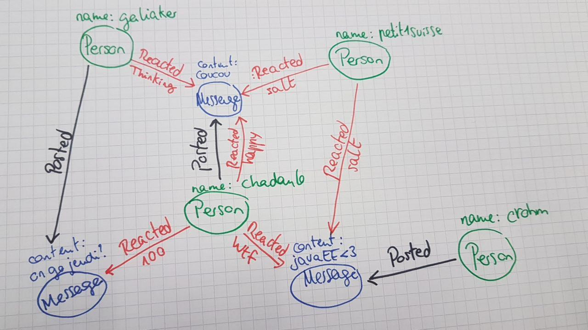

# MAC Modèle de données

> Burgener François, Gabrielli Alexandre, Póvoa Tiago

## Modèle graphe



On va utiliser un attribut de relation pour les réactions afin de savoir laquelle (exemple)

## Modèle document

```json
User {
	id // discord id
  nickname // pseudo
}
```


```json
Message {
	id
	content // contenu du message
  writtenBy // id de l'utilisateur
  timestamp
  cacheprofile {...} // Le top des réactions que l'utilisateur sucite
}
```

## Requêtes

* Top Messages d'un utilisateur avec le plus de réactions
  * " et le plus de réactions d'un type particulier
* Top utilisateurs ayant réagit à un utilisateur donné
  * et par catègorie
* Connaître les personnes liés à un utilisateur donné
  * Avec différent niveau de profondeur
* Profile de réactions d'un utilisateur
* Trouver des profiles similaires
* Trouver des utilisateurs qui ont des opinions similaire à nous sur quelqu'un