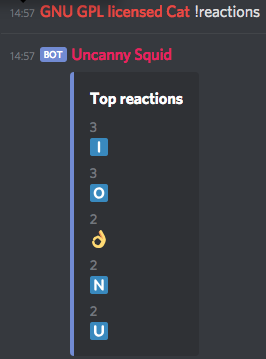
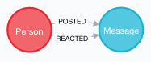

# Bot Discord - Reaction graph

> HEIG - Méthode d'accès aux données
>
> Burgener François, Gabrielli Alexandre, Póvoa Tiago


This bot is based on discord.js. It allows you to track the reactions on a discord server and build a cool graph database. 

## How to start



### Token

To connect your bot to discord, you need to get a token.

Get it here: https://discordapp.com/developers

Create a bot, give it a fun picture, and then retrieve your **token**. You'll need it later

You'll have to go to oAuth page to add your bot to your server. Give it the right permissions and that's it.

Note: you need to give the bot the right to:

* see channels
* send messages
* send links (So we can use RichEmbed feature)

### Environnement and configuration

You'll have to create a `.env` file in order to add the environment variables.

The following is an example of how to do it:

```
BOT_TOKEN=*INSERT YOUR TOKEN HERE*
PREFIX=!
URI_NEO4J=bolt://localhost
USER_NEO4J=neo4j
PASSWORD_NEO4J=neo4j
URI_MONGO=localhost
USER_MONGO=root
PASSWORD_MONGO=example
```

Now let's see where to use it.

### Production

To start the project, add your `.env` file here: `topology/prod`.

then run it with `docker-compose up` from this same folder.

Now you can track all the nasty messages from your friends as soon as someone reacts to it. Enjoy :smile:

### Dev

Start the docker topology here: `topology/dev` so you can have the databases ready.

Then add your `.env` file here: `bot/node-bot/`

And start the Node server manually:

```
npm install
npm start 
```

Optionally: `npm run dev` to start with nodemon (hot reload, wow).

## How it works

### What we used

* Node.js
* Discord.js
* Neo4j
* Mongodb

### Schema

Here is our graph model:



Document models:

Person

```json
{
 avatar, #avatar url
 tag,
 id, #user discord id
}
```

Message

```json
{
 content,
 id,
 createdAt,
 reactions: [reaction],
}
```

### What we did

We have implemented the following (from the spec):

- [x] Top messages from a user (with the most reactions)
  - [x] And specify a particular emoji
- [x] Top users who reacted to a user
  - [x] And specify a particular emoji
  - [x] Find friends at other depth levels (In our implem. you can find at 2nd lvl of depth)
- [x] Top reactions from a user (Profile)
  - [ ] Find similar profiles
  - [ ] Find users who have similar reactions to someone

We did not implemented the two last features because of wild cucumbers and REST APIs. (AMT)

And added some other features:

- [x] Find the path between you and another user

### Commands

| Command              | Explanation                                                  |
| -------------------- | ------------------------------------------------------------ |
| !msg                 | Top messages from you                                        |
| !msg [emoji]         | Top messages filtered by a specific emoji                    |
| !reactions           | Top reactions people give you                                |
| !friends             | Top friends who react to you                                 |
| !friends [emoji]     | Top friends who react to you with a specific emoji           |
| !suggest             | Suggestion of friends in 2nd degree                          |
| !path [someone#9999] | Gives you a path to him (people you should talk to, to become friends) |

### Queries

Here is a sample of some complexe queries

#### Shortest path between a user and a target

```cypher
MATCH (start:Person { name: $source }),(end:Person { name: $target }), 
   p = shortestPath((start)-[*]-(end))                                                                                        UNWIND nodes(p) AS n
WITH n
WHERE 'Person' IN LABELS(n)
RETURN n.name AS Names
```

First line, we define **start** and **end** as Person nodes.

We then proceed a shortest Path between the two. This will give us a path p.

Now, we unwind the path to convert it to a list of nodes.

Finally, let's filter out the Message Nodes. And here we have a list of names from A to B.

#### Similarity

As we were coding, we pased by some fun feature: similarity. We did not implemented this request in the bot for now. It would need a bit of tuning to filter only for a specific user.

```cypher
CALL algo.nodeSimilarity.stream('Person | Message', 'REACTED', {
  direction: 'OUTGOING'
})
YIELD node1, node2, similarity
RETURN algo.asNode(node1).name AS Person1, algo.asNode(node2).name AS Person2, similarity
ORDER BY similarity DESCENDING, Person1, Person2
```

We still added it to the report to show some possibilities of our graph database.

| Person1                            | Person2                            | similarity          |
| :--------------------------------- | :--------------------------------- | :------------------ |
| "Babb The 山羊 21#2026"            | "François T#6687"                  | 0.3333333333333333  |
| "François T#6687"                  | "Babb The 山羊 21#2026"            | 0.3333333333333333  |
| "Chadanlo#1520"                    | "JackEri#4455"                     | 0.11764705882352941 |
| "JackEri#4455"                     | "Chadanlo#1520"                    | 0.11764705882352941 |
| "Haero#9008"                       | "Yoga, Dieu parmi les Hommes#3087" | 0.1111111111111111  |
| "Yoga, Dieu parmi les Hommes#3087" | "Haero#9008"                       | 0.1111111111111111  |
| "Chadanlo#1520"                    | "François T#6687"                  | 0.05555555555555555 |
| "François T#6687"                  | "Chadanlo#1520"                    | 0.05555555555555555 |